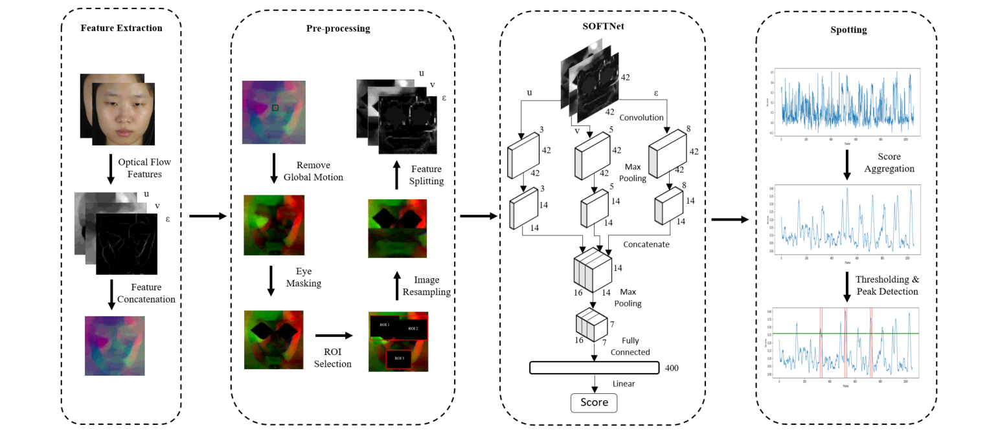
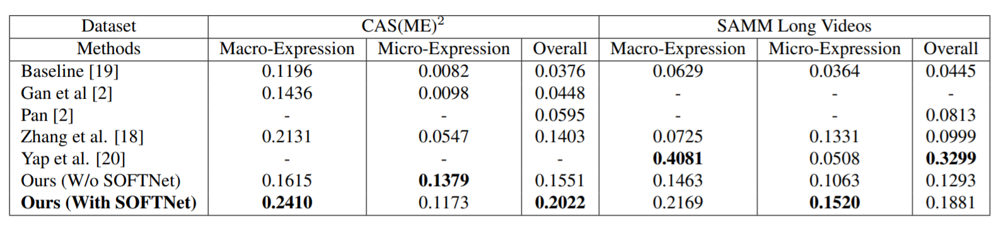
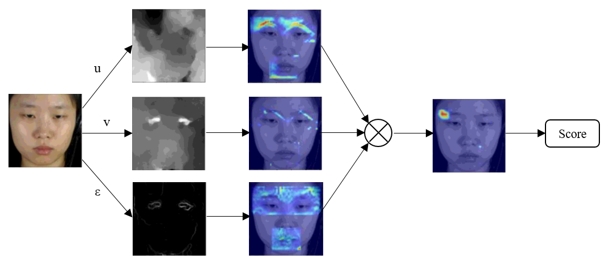

# Shallow Optical Flow Three-Stream CNN For Macro and Micro-Expression Spotting From Long Videos

## Framework of Proposed SOFTNet approach
Overall framework: </br></br>


Mainly four phases involved: 
<ul>
<li> Feature Extraction - Extract the optical flow features (u, v, ε) that represents each frame. </li>
<li> Pre-processing - Remove global head motion, eye masking, ROI selection, and image resampling. </li>
<li> SOFTNet - Three-stream shallow architecture that takes inputs (u, v, ε) and outputs a spotting confidence score. </li>
<li> Spotting - Smoothing spotting confidence score, then perform thresholding and peak detection to obtain the spotted interval for evaluation. </li>
</ul>

## Training
Tensorflow and Keras are used in the experiment. Two datasets with macro- and micro-expression are used for training and testing purposes:

CAS(ME)<sup>2</sup> - http://fu.psych.ac.cn/CASME/cas(me)2-en.php

SAMM Long Videos - http://www2.docm.mmu.ac.uk/STAFF/M.Yap/dataset.php

## Results
### Evaluation
Comparison between the proposed approaches against baseline and state-of-the-art approaches in Third Facial Micro-Expression Grand Challenge (MEGC 2020) in terms of F1-Score:


### Visualization
Samples visual results for SOFTNet: </br></br>


### Discussion
The proposed SOFTNet approach outperforms other methods on CAS(ME)<sup>2</sup> while ranked second on SAMM Long Videos. To better justify the effectiveness of the SOFTNet approach, we experimented with a similar framework but without SOFTNet, the results show that the framework with SOFTNet is much more efficient overall.

Visually, SOFTNet activation units show our intuition to concatenate the optical flow features (u, v, ε) from three-stream. The spatio-temporal motion information is captured when macro and micro-expression occur. After the concatenation, action unit 4 (Brow Lower) is triggered when a disgust emotion is elicited. 

## Reproduce the results for SOFTNet approach (with python script)

<b>Step 1)</b> Download datasets, CAS(ME)<sup>2</sup> (CASME_sq) and SAMM Long Videos (SAMMLV) and placed in the structure as follows:
>├─SOFNet_Weights <br>
>├─Utils <br>
>├─extraction_preprocess.py <br>
>├─load_images.py <br>
>├─load_label.py <br>
>├─main.py <br>
>├─requirements.txt <br>
>├─training.py <br>
>├─CASME_sq <br>
>>├─CAS(ME)^2code_final.xlsx <br>
>>├─cropped <br>
>>├─rawpic <br>
>>├─rawvideo <br>
>>└─selectedpic <br>

>├─SAMMLV <br>
>>├─SAMM_longvideos <br>
>>└─SAMM_LongVideos_V1_Release.xlsx <br>

<b>Step 2)</b> Installation of packages using pip

``` pip install -r requirements.txt ```
<!--
<b>Step 3)</b> Dataset setting

Open main.py, change the dataset name and expression type for evaluation.
-->
<b>Step 3)</b> SOFTNet Training and Evaluation

``` python main.py ```

#### Note for parameter settings <br>
&nbsp; --dataset_name (CASME_sq or SAMMLV) <br>
&nbsp; --expression_type (micro-expression or macro-expression) <br>
&nbsp; --train (True or False) <br>
&nbsp; --show_plot (True or False) <br>

<!--
## Reproduce the results for SOFTNet approach (with Jupyter Notebook)

The step-by-step codes with explaination are provided here for a better understanding.

<b>Step 1)</b> Similar to the step 1 with python script.

<b>Step 2)</b> Feature Extraction and Pre-processing

<blockquote> Open the Extraction_Preprocess.ipynb and run the codes follow the instruction given inside. </blockquote>

<b>Step 3)</b> SOFTNet and Spotting

<blockquote> Open the SOFTNet_Spotting.ipynb and run the codes follow the instruction given inside. The evaluation for TP, FP, FN, F1-Score is returned at the last piece of code. </blockquote>
-->
## Note for pre-trained weights
The pre-trained weights for CAS(ME)<sup>2</sup >and SAMM Long Videos with macro and micro-expression separately are located under folder SOFTNet_Weights. You may load the weights for evaluation. However, the result is slightly different from the result given in the table shown above.

## Link to research paper

If you find this work useful, please cite the paper:
https://arxiv.org/pdf/2106.06489.pdf

@inproceedings{liong2021shallow, <br>
  title={Shallow optical flow three-stream CNN for macro-and micro-expression spotting from long videos}, <br>
  author={Liong, Gen-Bing and See, John and Wong, Lai-Kuan}, <br>
  booktitle={2021 IEEE International Conference on Image Processing (ICIP)}, <br>
  pages={2643--2647}, <br>
  year={2021}, <br>
  organization={IEEE} <br>
}

##### Please email me at genbing67@gmail.com if you have any inquiries or issues.

